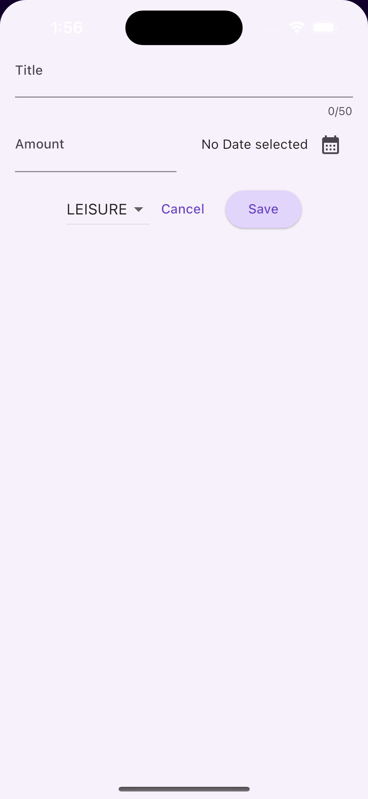

# expense_tracker

A new Flutter project.

## List of Components
- Expenses List
- Expense Detail
- New_Expense
- Dismissable - Delete Sample Data

## Included List of Widgets in this project
- Show Dialog
- TextInput
- IconButton
- AppBar 
- ListView
- Column
- Expanded
- Dismissable Widget for the list
- Snackbar
- ModalBottomShee
- Themese for the App

## Themese:
## Dark Mode Example 

 

 

## Light Mode App Screenshot Sample
- Light Theme
  
   
  
   
  